# AMET2026_coex_stier

2026 AMET 자율주행 해커톤에서 사용한 PhysiCar 기반 ROS 2 자율주행 워크스페이스입니다. LiDAR와 카메라 인지, 경로 계획, 차량 제어 노드를 포함합니다.

## 나의 역할

- **담당:** LiDAR 데이터 처리, 장애물 클러스터링, Object Detector 구현
- **직접 수행:** LiDAR 입력 범위와 좌표를 확인하고, 클러스터링 결과를 장애물 정보로 변환해 다른 ROS 2 노드에서 사용할 수 있도록 연결
- **검증:** RViz와 발행 토픽을 함께 보며 장애물의 위치·개수와 차량 좌표계 기준 결과를 확인
- **개선에 반영한 점:** 이전 대회에서 겪은 Voxel 단위 군집화 문제를 바탕으로, 클러스터 경계와 출력 조건을 먼저 확인하며 구현
- **사용 기술:** ROS 2, Python, LiDAR, 클러스터링, 사용자 정의 메시지, RViz

이 저장소는 팀 프로젝트 전체 코드를 포함합니다. 위 내용은 제가 맡은 범위이며, 신호등 인식·경로 계획·차량 제어 등 다른 기능은 팀원들과 나누어 개발했습니다.

## How to clone

```bash
mkdir -p /home/physicar
git clone https://github.com/Team-Stier/AMET2026_coex_stier.git /home/physicar/physicar_ws
cd /home/physicar/physicar_ws
```

## Convention

### 좌표계

- ego 로컬 좌표계는 LiDAR frame인 `lidar_link`를 사용한다. 차량의 진행 방향은 `+x`,
  진행 방향의 왼쪽은 `+y`이다.
- 프로젝트의 글로벌 좌표계는 `map` frame을 사용한다.
- RViz의 `TopDownOrtho` 화면은 위쪽이 `map`의 `+x`, 왼쪽이 `map`의 `+y`가 되도록
  고정한다. 따라서 화면 오른쪽은 `-y`, 아래쪽은 `-x`이다. 이는 카메라 표시 방향만
  정하는 계약이며 아래 `/pose` 보정과 별개로 메시지 좌표나 TF를 회전시키지 않는다.
- Pose TF Node는 `/odom/laser` pose를 Z축 시계방향 `90°` 회전한 뒤
  `rddf/centerline.csv` 첫 점 `(x₀, y₀)`을 더한다.
  `x_map = x₀ + y_odom_laser`, `y_map = y₀ - x_odom_laser`,
  `q_map = RotZ(-90°) · q_odom_laser`를 사용하고 높이, timestamp와 covariance는 그대로 둔다.
- 변환 결과는 처음부터 `header.frame_id: map`, `child_frame_id: lidar_link`인 `/pose`로
  발행한다. `map → lidar_link` TF도 `/pose`와 동일한 위치, timestamp 및 Z축 시계방향
  `90°`가 적용된 orientation을 사용한다. 그 밖의 좌표 정합, 최신 pose 대체 또는
  source fallback은 사용하지 않는다.

### 차량 제원

- 크기: 폭 200 mm × 길이 280 mm
- 휠베이스: 0.18 m

## 패키지 구조 설계

- 각 패키지의 소스 코드, 설정, 모델, 테스트 및 패키지 전용 실행 스크립트는 반드시
  `src/<package_name>/` 안에 둔다. 패키지를 개발하면서 저장소 루트나 다른 패키지
  폴더에 소스 코드가 역류하지 않도록 주의한다.
- 프로젝트 내부 패키지는 메시지 전용 `interfaces` 패키지를 제외한 다른 내부 패키지를
  직접 참조하지 않는다. 다른 패키지의 Python 모듈을 import하거나 소스 파일을 상대
  경로로 읽지 않으며, `package.xml`과 빌드 설정에도 다른 내부 패키지 의존성을 추가하지
  않는다.
- 내부 패키지 간 데이터 전달은 ROS 2 토픽, 서비스 또는 액션으로만 수행한다. 패키지
  사이에서 공유해야 하는 메시지·서비스·액션 타입은 `interfaces`에 정의한다.
- `rclpy`, `std_msgs`, `sensor_msgs`, `nav_msgs`와 같은 표준 ROS 2 패키지 및 필요한
  외부 라이브러리 의존성은 각 패키지에서 명시적으로 선언할 수 있다.

### 패키지 구성

```text
src/
├── interfaces/
├── object_detection/
├── traffic_light/
├── calibration/
├── pose_tf/
├── path_planning/
├── visualizer/
└── control/
```

`calibration`은 향후 구현을 위한 빈 패키지이며 실행 노드가 없다. `interfaces`도 실행
노드 없이 노드 패키지 사이에서 공유하는 사용자 정의 메시지, 서비스 및 액션 타입만
제공한다. 나머지 실행 패키지는 동명의 노드 하나와 1:1로 대응하되, 디버깅 전용
`visualizer`는 필요하면 여러 노드로 구성할 수 있는 예외로 둔다.

## ROS 2 architecture

ROS 관례에 따라 노드는 원으로, 토픽은 사각형으로 표현한다. 토픽 사각형은
구분선 위에 토픽 이름, 아래에 메시지 타입을 표시한다.

```mermaid
flowchart TD



    %% PhysiCar sensor topics
    subgraph Rawdata[Raw data]
        LIDAR["/scan<br/>================<br/>sensor_msgs/LaserScan"]
        IMAGE["/camera/image_raw/compressed<br/>================<br/>sensor_msgs/CompressedImage"]
        ODOM["/odom<br/>================<br/>nav_msgs/Odometry"]
        ODOM_LASER["/odom/laser<br/>================<br/>nav_msgs/Odometry"]
    end

    subgraph Localization[Localization]
        POSE_TF(("Pose TF Node"))
        POSE["/pose<br/>================<br/>nav_msgs/Odometry<br/>map → lidar_link"]
        MAP_LIDAR_TF["/tf<br/>================<br/>tf2_msgs/TFMessage<br/>map → lidar_link"]
    end
    rddf("rddf") --> POSE_TF
    ODOM_LASER --> POSE_TF
    POSE_TF --> POSE
    POSE_TF --> MAP_LIDAR_TF

    %% Perception nodes and topics
    subgraph Perception[Perception]
        OBJECT_DETECT(("Object Detection Node"))
        TL(("Traffic Light Node"))
        OBJECT_INFO["/object_info<br/>================<br/>interfaces/msg/Objects"]
        TL_RESULT["/gosign<br/>================<br/>std_msgs/Bool"]

    end

    %% Localization, planning, and control

    subgraph judgement[judgement]
        PATH_PLANNING(("Path Planning Node"))
        PATH["/path<br/>================<br/>nav_msgs/Path"]
    end

    rddf --> PATH_PLANNING

    subgraph Visualization[Visualization]
        VISUALIZER(("Visualizer Node"))
        SIM_STATE["SIM API /state<br/>================<br/>HTTP JSON"]
        RDDF_CENTERLINE["/rddf/centerline<br/>================<br/>nav_msgs/Path"]
        RDDF_INNER["/rddf/inner_boundary<br/>================<br/>nav_msgs/Path"]
        RDDF_OUTER["/rddf/outer_boundary<br/>================<br/>nav_msgs/Path"]
        EGO_SIM["/rddf/ego_marker_sim<br/>================<br/>visualization_msgs/Marker"]
        EGO_POSE["/rddf/ego_marker_pose<br/>================<br/>visualization_msgs/Marker"]
        SEARCH_TREE["/path_planning/debug/search_tree<br/>================<br/>interfaces/msg/SearchTree"]
        GLOBAL_PATH["/path_planning/debug/global_path<br/>================<br/>nav_msgs/Path (future publisher)"]
        SEARCH_TREE_MARKER["/visualizer/path_planning/search_tree<br/>================<br/>visualization_msgs/Marker"]
        GLOBAL_PATH_VIZ["/visualizer/path_planning/global_path<br/>================<br/>nav_msgs/Path"]
        OBJECT_MARKER["/visualizer/object_info<br/>================<br/>visualization_msgs/Marker"]
        RVIZ(("RViz"))
    end
    rddf --> VISUALIZER
    SIM_STATE --> VISUALIZER
    POSE --> VISUALIZER
    PATH_PLANNING --> SEARCH_TREE
    SEARCH_TREE --> VISUALIZER
    GLOBAL_PATH --> VISUALIZER
    OBJECT_INFO --> VISUALIZER
    VISUALIZER --> RDDF_CENTERLINE
    VISUALIZER --> RDDF_INNER
    VISUALIZER --> RDDF_OUTER
    VISUALIZER --> EGO_SIM
    VISUALIZER --> EGO_POSE
    VISUALIZER --> SEARCH_TREE_MARKER
    VISUALIZER --> GLOBAL_PATH_VIZ
    VISUALIZER --> OBJECT_MARKER
    LIDAR --> RVIZ
    MAP_LIDAR_TF --> RVIZ
    RDDF_CENTERLINE --> RVIZ
    EGO_POSE --> RVIZ

    subgraph Control[Control]
        CONTROL_PID(("Control Node"))
        SPEED["/speed<br/>================<br/>std_msgs/Float64"]
        CAMERA_PAN["/camera/pan<br/>================<br/>std_msgs/Float64"]
        STEERING["/steering<br/>================<br/>std_msgs/Float64"]
    end


    %% LiDAR pipeline
    LIDAR --> OBJECT_DETECT
    OBJECT_DETECT --> OBJECT_INFO
    OBJECT_INFO --> PATH_PLANNING

    %% Camera pipeline
    IMAGE --> TL
    TL --> TL_RESULT
    TL_RESULT --> CONTROL_PID
    TL_RESULT --> PATH_PLANNING

    %% Localization
    POSE --> PATH_PLANNING

    %% Planning and control
    PATH_PLANNING --> PATH
    PATH --> CONTROL_PID
    CONTROL_PID --> SPEED
    CONTROL_PID --> STEERING
    CONTROL_PID --> CAMERA_PAN

    HW((("HW")))

    SPEED --> HW
    CAMERA_PAN --> HW
    STEERING --> HW

```



Sensor and control topic contracts follow the
[PhysiCar ROS reference](https://physicar.ai/ko/learn/reference/physicar-ros/).

### Nodes

- **Object Detection Node**: `/scan`의 LiDAR 거리 데이터를 이용해 주행 경로상의 장애물을 클러스터링하고, 장애물들을 원으로 피팅 후 원의 중심점을 리스트로 `/object_info`발행한다.
- **Traffic Light Node**: `/camera/image_raw/compressed`의 카메라 영상에서 `yolo`를 이용해 신호등을 판독한다. 초록 신호가 연속 3프레임 확인되면 `/gosign=true`를 한 번 발행하고, reliable 전송의 ACK를 확인한 뒤 정상 종료한다. 실행 환경에 `yolo`sw가 설치 되어 있으므로 개발시 참고하도록 한다.
- **Pose TF Node**: `/odom/laser` pose를 Z축 시계방향 `90°` 회전하고 centerline 첫 점을 더한 `/pose`와
  동일한 `map → lidar_link` TF를 발행한다. 둘의 orientation 모두 Z축 시계방향 `90°`를
  적용한다.
- **Path Planning Node**: RDDF 경로와 `/pose`, `/object_info`를 이용해 `map` 좌표에서
  경로를 계획하고 `/path`로 발행한다.
- **Visualizer Node**: 세 RDDF CSV를 `map` frame의 Path로 발행한다. `/pose` 기반 초록색
  ego Marker를 발행하며 TF는 발행하지 않는다. Path Planning의 SearchTree와 글로벌 경로도
  `map` frame으로 표시한다. `/object_info`는 원본 timestamp와 `lidar_link` 좌표를 유지한
  구형 Marker로 표시하여 ego의 이동과 회전을 따른다. RViz의 원본 `/scan`은 Pose TF Node의 TF로 표시한다.
- **Control Node**: `/path`와 `/gosign`을 바탕으로 차량의 속도, 조향각, 카메라 팬 각도를 계산해 각각의 제어 토픽으로 발행한다.

### Topics

- **`/scan`** (`sensor_msgs/LaserScan`): LiDAR가 측정한 각도별 거리 데이터. Object Detection Node의 입력으로 사용한다.
- **`/camera/image_raw/compressed`** (`sensor_msgs/CompressedImage`): JPEG 형식의 압축 카메라 영상. Traffic Light Node가 구독한다.
- **`/odom`** (`nav_msgs/Odometry`): LiDAR와 IMU를 융합해 추정한 차량의 위치, 자세 및 속도 정보.
- **`/odom/laser`** (`nav_msgs/Odometry`): Pose TF Node가 구독하는 LiDAR odometry 원본.
- **`/pose`** (`nav_msgs/Odometry`): `/odom/laser`의 위치와 orientation을 Z축 시계방향
  `90°` 회전하고 centerline 첫 점을 더한 SIM GT 기준 전역 차량 pose. `header.frame_id`는 `map`,
  `child_frame_id`는 `lidar_link`이며 Path Planning과 Visualizer의 기본 pose 입력이다.
- **`/object_info`** (`interfaces/msg/Objects`): Object Detection Node가 생성한 장애물 탐지 결과. 장애물 중심점은 `lidar_link` 로컬 좌표이며 `+x`는 전방, `+y`는 좌측이다.
```cpp
// interfaces/msg/Objects.msg
std_msgs/Header header

int32 length
float32[20] x
float32[20] y
```
- **`/visualizer/object_info`** (`visualization_msgs/Marker`): `/object_info`의 유효한 중심점들을
  원본 timestamp와 `lidar_link` frame 그대로 유지한 `SPHERE_LIST` Marker. RViz가 해당 시각의
  `map → lidar_link` TF를 적용하므로 장애물은 ego의 이동과 회전에 붙어서 표시된다.
- **`/gosign`** (`std_msgs/Bool`): 신호등 인식 결과에 따른 진행 가능 여부. Control Node는 최초 `true`를 주행 시작 신호로 래치하고, Path Planning Node는 대기 중인 PlanningWorker를 활성화한다.
- **`/path`** (`nav_msgs/Path`): Path Planning Node가 `map` frame으로 생성한 차량 주행 경로. Control Node의 입력으로 사용한다.
- **`/rddf/centerline`** (`nav_msgs/Path`): CSV 좌표를 그대로 사용한 `map` frame RDDF 중앙선. RViz에서 노란색으로 표시한다.
- **`/rddf/inner_boundary`** (`nav_msgs/Path`): CSV 좌표를 그대로 사용한 `map` frame RDDF 안쪽 경계선.
- **`/rddf/outer_boundary`** (`nav_msgs/Path`): CSV 좌표를 그대로 사용한 `map` frame RDDF 바깥쪽 경계선.
- **`/rddf/ego_marker_sim`** (`visualization_msgs/Marker`): SIM GT 기반 청록색 차량 Marker.
- **`/rddf/ego_marker_pose`** (`visualization_msgs/Marker`): `/pose` 기반 초록색 차량 Marker.
- **`/path_planning/debug/search_tree`** (`interfaces/msg/SearchTree`): Path Planning이 발행하는
  `map` frame Hybrid A* 부모-자식 탐색 트리.
- **`/visualizer/path_planning/search_tree`** (`visualization_msgs/Marker`): SearchTree의 각
  부모-자식 간선을 `LINE_LIST`로 변환한 Marker.
- **`/path_planning/debug/global_path`** (`nav_msgs/Path`): Path Planning이 이후 발행할 전체
  `map` frame 계획 경로 입력 계약. 현재 publisher가 없어도 visualizer는 이 이름을 미리 구독한다.
- **`/visualizer/path_planning/global_path`** (`nav_msgs/Path`): 글로벌 경로의 좌표와
  timestamp와 `map` frame을 유지한 RViz용 복제본.
- **`/tf`** (`tf2_msgs/TFMessage`): Pose TF Node가 `/pose`와 동일한 위치와 timestamp,
  Z축 시계방향 `90°`가 적용된 동일한 orientation으로 발행하는 `map → lidar_link` 변환.
  Visualizer는 TF를 추가로 발행하지 않는다.

RViz의 fixed frame은 `map`이다. `/scan`은 복제하거나 좌표를 변환한 별도 토픽 없이 원본을
직접 구독하며, `map → lidar_link` TF를 통해 초록색으로 표시한다.

- **`/speed`** (`std_msgs/Float64`): 차량의 목표 속도 명령. 단위는 m/s이다.
- **`/steering`** (`std_msgs/Float64`): 차량의 목표 조향각 명령. 단위는 rad이며 양수는 좌회전,
  하드 제한은 약 `±0.35 rad`(`±20°`)다.
- **`/camera/pan`** (`std_msgs/Float64`): 카메라의 목표 팬 각도 명령. 단위는 rad이며 양수는 왼쪽 회전을 의미한다. 실제 서보 위치 피드백이 아니라 명령값이다.

#### 기본 토픽 발행 주기

아래 값은 PhysiCar SIM의 명목 주기와 2026-08-22에 단일 구독자로 10초간 측정한
실시간 발행률이다. 시뮬레이터 부하와 RTF에 따라 실측값은 달라질 수 있다.

| 토픽 | 역할 | 명목 주기 | 실측 주기 |
|---|---|---:|---:|
| `/camera/image_raw` | 원본 카메라 | 약 15 Hz | 9.56 Hz (원본 영상 수신 드롭 포함) |
| `/camera/image_raw/compressed` | 압축 카메라 | 약 15 Hz | 14.34 Hz |
| `/imu` | 가속도·각속도 | 50 Hz | 46.74 Hz |
| `/imu/mag` | 자기장 | 50 Hz | 46.97 Hz |
| `/joint_states` | 조향·바퀴·카메라 관절 | 200 Hz | 187.19 Hz |
| `/scan` | 원본 LiDAR | 10 Hz | 9.39 Hz |
| `/scan_filtered` | 필터링 LiDAR | 10 Hz | 9.39 Hz |
| `/odom/laser` | LiDAR odometry | 10 Hz | 9.39 Hz |
| `/odom` | LiDAR와 IMU를 융합한 EKF odometry | 30 Hz | 28.19 Hz |
| `/battery_state` | 배터리 상태 | 1 Hz | 1.00 Hz |
| `/diagnostics` | EKF 진단 | 약 1 Hz | 0.94 Hz |
| `/tf` | EKF와 관절의 동적 좌표변환 합계 | 약 50 msg/s | 47.02 msg/s |
| `/clock` | 시뮬레이션 시간(SIM 전용) | 200 Hz | 186.48 Hz |

`/tf_static`과 `/robot_description`은 시작 시 발행되며 고정 주기가 없다. `/rosout`과
`/parameter_events`는 이벤트 기반이고, `/cmd_vel`, `/speed`, `/steering`,
`/camera/pan`, `/camera/tilt`는 제어 명령이 들어올 때 발행된다. 실차의 RPLIDAR C1
`/scan` 주기는 하드웨어 회전속도에 따라 8–12 Hz 범위이며 일반값은 10 Hz이다.

### External inputs and outputs

- **RDDF**: 차량이 따라야 할 기준 경로 데이터로, Path Planning Node의 경로 계획 기준으로 사용한다.
- **HW**: `/speed`, `/steering`, `/camera/pan` 명령을 받아 차량과 카메라를 구동하는 실제 하드웨어 계층이다.

## Bringup
배포 환경에서 프로젝트 루트는 `/home/physicar/physicar_ws`이다. 전체 프로그램은
어느 디렉터리에서든 다음 명령 하나로 빌드하고 실행할 수 있어야 한다.

```bash
source /home/physicar/physicar_ws/run.sh
```

`run.sh`는 source 호출을 감지하면 별도의 Bash 프로세스에서 bringup을 수행해 호출한
셸의 옵션, 작업 디렉터리, trap을 변경하지 않아야 한다. 실행 프로세스는 ROS 2 Jazzy
환경을 불러오고 `colcon build --cmake-clean-cache`를 실행한 뒤,
Object Detection → Control → Pose TF → Calibration → Path Planning → Traffic Light →
Visualizer/RViz 순서로 노드를 시작한다. Control Node와 Path Planning Node를 Traffic Light
Node보다 먼저 시작해 `/gosign` 구독을 준비한다. Path Planning Worker는 처음에는 연산 없이
대기하고 `/gosign=true`를 받으면 계획을 시작한다. Traffic Light Node는 최초
`/gosign=true`를 한 번 발행한 뒤 정상 종료하며,
나머지 상시 실행 노드가 종료되면 전체 프로그램도 종료한다. `Ctrl+C`를 누르면
스크립트가 실행한 모든 노드를 함께 종료한다.

각 실행 노드 패키지는 `run.sh`를 위해 해당 노드를 올리는 한 줄의 `ros2 run` 명령을
기본으로 제공한다. 패키지 전용 초기화가 필요한 경우에는 같은 역할을 하는
`./src/<pkgname>/launch.sh`를 둘 수 있다. `visualizer`는 노드와 설정된 RViz를 함께
시작하는 `./src/visualizer/launch.sh`를 `run.sh`가 직접 호출한다. 메시지 전용
`interfaces` 패키지는 이 규칙의 대상이 아니다.

```bash
ros2 run object_detection object_detection_node
ros2 run control control_node
ros2 run traffic_light traffic_light_node
ros2 run pose_tf pose_tf_node
ros2 run path_planning path_planning_node
./src/visualizer/launch.sh
```

예를 들어 패키지별 환경변수, 모델 경로, 파라미터 파일 등의 초기화가 필요해
`launch.sh`를 추가했다면, 해당 패키지 개발자는 `run.sh`의 `ros2 run` 실행 줄을
다음 `launch.sh` 실행 줄로 직접 교체해야 한다. `run.sh`는 `launch.sh`의 존재 여부를
자동으로 감지하지 않는다. 아래 스크립트는 선택적 실행 계약의 경로 예시이며, 실제
파일을 추가한 패키지에만 적용한다.

```bash
./src/object_detection/launch.sh
./src/traffic_light/launch.sh
./src/pose_tf/launch.sh
./src/path_planning/launch.sh
./src/control/launch.sh
./src/visualizer/launch.sh
```

RDDF 경로, SIM·`/pose` 차량 Marker, 원본 `/scan`, 글로벌 경로와 SearchTree가 미리
추가되고 fixed frame이 `map`으로 설정된 RViz는 패키지 실행 스크립트가 visualizer
노드와 함께 시작한다.

```bash
./src/visualizer/launch.sh
```

같은 launch를 비시뮬레이션 환경에서 사용해도 된다. SIM API가 없으면 SIM source만
주기적으로 재시도하며 `/pose` Marker와 RDDF·Path Planning 시각화는 계속 동작한다.
SIM API는 sensor timestamp를 제공하지 않으므로 GT는 `/state` 요청 시점에 가장 가까운
latest pose이며 `/scan`과 exact sensor-time sync를 보장하지 않는다.
